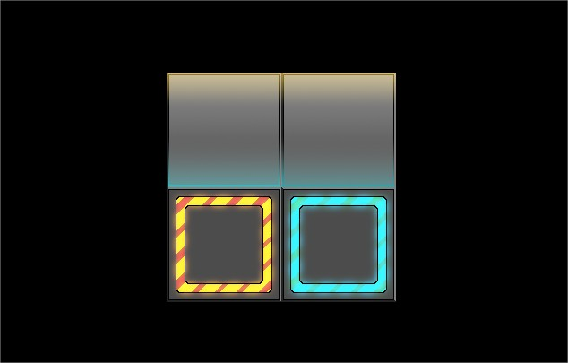
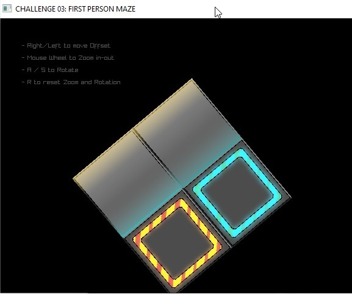
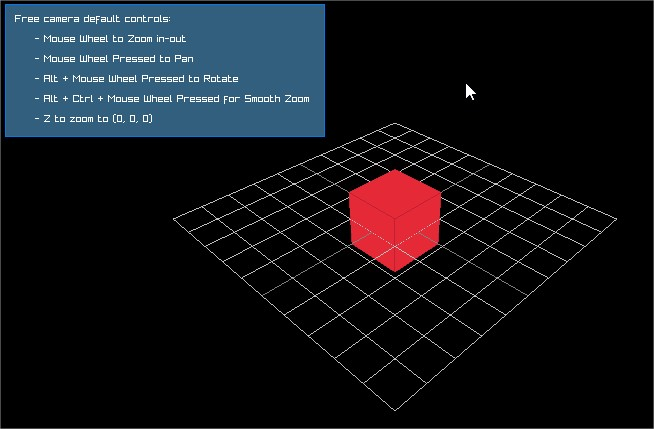
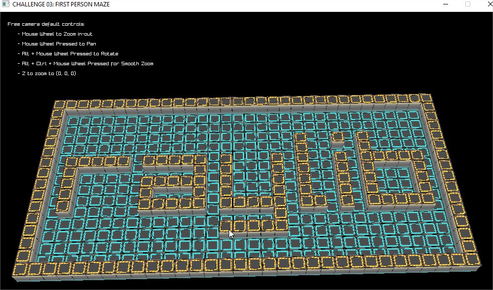
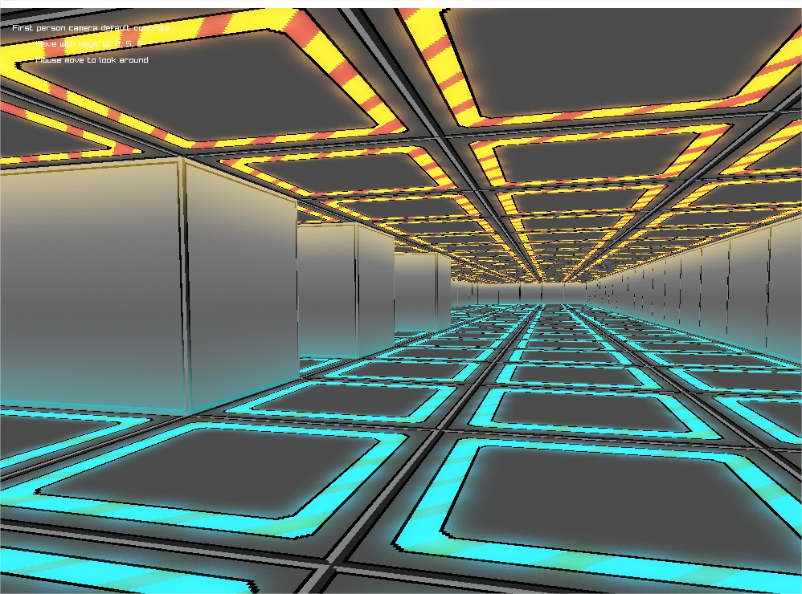
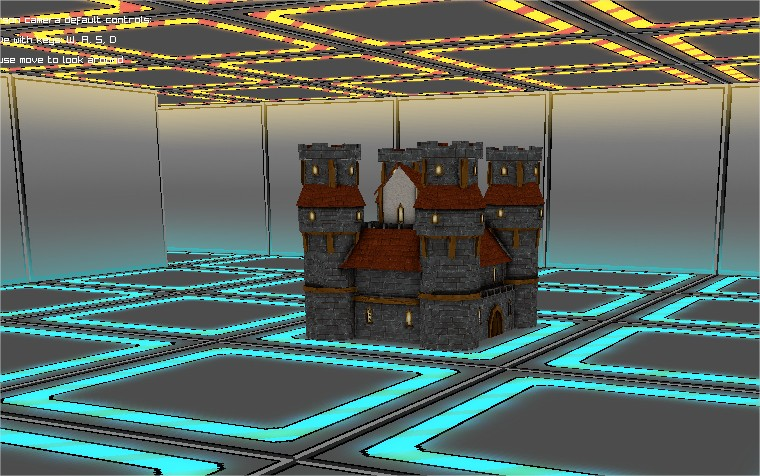

# Challenge 03: 3D Maze game

*by Ramon Santamaria ([@raysan5](https://twitter.com/raysan5)) and Ester Arroyo*  


## Introduction
In this challenge we will implement a 3D Maze game similar to classic game [Doom](https://en.wikipedia.org/wiki/Doom_(series)) (id Software, 1993). Along this process we will learn how to manage vertex data and contruct levels with it.

This game is developed using Raylib, a simple and easy-to-use library to enjoy videogames programming.

Before starting with this challenge, it's recommended to complete the previous challenges: 
 - [Challenge 01: Blocks game](https://github.com/raysan5/challenges/tree/master/01_challenge_blocks) - A blocks game where player has to break a wall of blocks controlling a ball with a paddle.
 - [Challenge 02: 2D Dungeon game](https://github.com/eteg09/UOC_PG_2022_23/tree/main/PAC2) - A tile-based dungeon 2D game where player moves around a 2D dungeon finding keys and defeating monsters.

It's assumed that all concepts explained in those challenges have already been learnt by student.

**Previous knowledge required:**
 - Videogame life cycle (Init -> Update -> Draw -> DeInit)
 - Basic screens management with screens transition
 - Collision detection and resolution
 - Sounds and music loading and playing

**Learning Outcomes:**
 - Window creation, configuration and management
 - Inputs management (keyboard, mouse)
 - Image loading (RAM), texture creation (VRAM) and drawing
 - Models loading, transform and drawing (3d meshes)
 - Camera system creation and management (2D and 3D camera)
 - Collision detection and resolution (AABB collisions)
 
**NOTE:** All code provided is in C language for simplicity and clearness but it's up to the student to use more complex C++ code structures (OOP) if desired.
 
## Lessons Summary

Lesson | Learning outcome | Source file | Related functions
:-----:|------------------|:------------|:-----------------:
[01](#lesson-01-introduction-and-textures) | window and context creation, <br>image loading, <br>texture creation and drawing | [01_maze_game_intro_and_textures.c](Lessons/01_maze_game_intro_and_textures.c) | InitWindow(), <br>CloseWindow(), <br>LoadImage(), LoadTexture()
[02](#lesson-02-game-camera2D-Orthograhic) | Camera 2D System (Orthographic) | [02_maze_game_camera2D_Orthographic.c](Lessons/02_maze_game_camera2D_Orthographic.c) | Camera2D, <br>BeginMode2D(camera), <br>EndMode2D()
[03](#lesson-03-game-camera3D-Projection) | Camera 3D System (Camera Free) | [03_maze_game_camera3D_Projection.c](Lessons/03_maze_game_camera3D_Projection.c) | Camera3D, SetCameraMode(...), <br> UpdateCamera(...)
[04](#lesson-04-level-map-loading) | level map loading, <br>vertex buffers creation | [04_maze_creation_cubicmap.c](Lessons/04_maze_creation_cubicmap.c) | GenMeshCubicmap()
[05](#lesson-05-game-camera3D-FirstPerson) | Camera 3D System (First Person) | [05_maze_creation_camera3D_FirstPerson.c](Lessons/05_maze_creation_camera3D_FirstPerson.c) | Camera3D, SetCameraMode(...), <br> UpdateCamera(...)
[06](#lesson-06-collision-detection-and-resolution) | collision detection and resolution | [06_maze_game_collisions.c](Lessons/06_maze_game_collisions.c) | CheckCollisionCircleRec()
[07](#lesson-07-models-loading) | models loading and drawing | [07_maze_game_models.c](Lessons/07_maze_game_models.c) | LoadOBJ(), LoadModel(), <br>UnloadModel(), DrawModel()


**NOTE:** Most of the documentation for the challenge is directly included in the source code files as code comments. Read carefully those comments to understand every task and how implement the proposed solutions.

### Lesson 01: Introduction and textures

*Lesson code file to review: [01_maze_game_intro_and_textures.c](Lessons/01_maze_game_intro_and_textures.c)*

Initialize window and OpenGL context.

**Textures Loading**

We will load image data from a file, decompressing and/or decodifying information if required, and convert that image data to a texture (GPU uploading) and learn to draw that texture on the canvas.

Once image data is loaded, we will convert it to a texture and use it for drawing on the screen.

Functions to be implemented:
```c
Image LoadImage(const char *fileName);                   // Load image data from file (RAM)
void UnloadImage(Image image);                           // Unload image data from RAM
Texture2D LoadTextureFromImage(Image image);             // Load texture from image data (VRAM)
void UnloadTexture(Texture2D texture);                   // Unload texture from VRAM

void DrawTexture(Texture2D texture, Vector2 position, Color tint); // Draw texture in screen position coordinates
```

After executing the lesson 01, you should see a texture like this:

 

### Lesson 02: Game camera2D Orthograhic

*Lesson code file to review: [02_maze_game_camera2D_Orthographic.c](Lessons/02_maze_game_camera2D_Orthographic.c)*

We will learn how to manage a camera system in 2D and we will implement an Orthographic camera2D. We also define input events that will manipulate the position of this camera2D.

Note that all the elements we want to draw under the influence of this camera2D are inside the BeginMode2D and EndMode2D. To draw UI elements or text that will not be under the influence of this camera, will be drawn after the EndMode2d and before the EndDrawing().

Read the instructions to move the texture across the screen.


Commands to be implemented:
```c
Camera2D camera                  			// Create and initialize the struct camera2D
void BeginMode2D(Camera2D camera);          // Begin 2D mode with custom camera (2D)
void EndMode2D(void);                       // Ends 2D mode with custom camera
```

After executing the lesson02, you should see something like this (after some keyboard and mouse events):

 

### Lesson 03: Game camera3D Projection

*Lesson code file to review: [03_maze_game_camera3D_Projection.c](Lessons/03_maze_game_camera3D_Projection.c)*

We will learn how to manage a camera system in 3d and we will implement a free camera.

Actually, a camera system, as we understand it, doesn't exist, it only consist of a series of transformation we apply to all elements of our 3D world to simulate a 3D perspective and positioning.

Note that all the elements we want to draw under the influence of this camera3D are inside the BeginMode3D and EndMode3D. To draw UI elements or text that will not be under the influence of this camera, will be drawn after the EndMode3D and before the EndDrawing().

Read the instructions to move the cube across the screen.

Functions and commands to be implemented:
```c
Camera3D;										// Camera, defines position/orientation in 3d space
void SetCameraMode(Camera camera, int mode); 	// Select camera mode (multiple camera modes available)
void UpdateCamera(Camera *camera);            	// Update camera system with transformation relative to user inputs 
void BeginMode3D(Camera3D camera);              // Begin 3D mode with custom camera (3D)
void EndMode3D(void);                           // Ends 3D mode and returns to default 2D orthographic mode
```

After executing the lesson03, you should see something like this:

 

### lesson 04: Level map loading

*Lesson code file to review: [04_maze_creation_cubicmap.c](Lessons/04_maze_creation_cubicmap.c)*

In this lesson we are loading the level map from image data and we will generate a 3D cubes-based mesh for the level, defining all required vertex data. 

The image data you can find it in image/04_cubicmap.png and it looks like this:

 

Basically we will treat every white pixel as a cube with walls and every black pixel by an empty space, using this convention we will create every required cube vertex by vertex.

Read the instructions on the screen to move the camera across the screen.

Functions to be implemented:
```c
Mesh GenMeshCubicmap(Image cubicmap, float cubeSize);      // Generate cubicmap mesh from image data
```
After executing the lesson04, you should see something like this:

 

### Lesson 05: Game camera3D FirstPerson

*Lesson code file to review: [05_maze_creation_camera3D_FirstPerson.c](Lessons/05_maze_creation_camera3D_FirstPerson.c)*

We will learn how to manage a camera system in 3d and we will implement a first person camera.

In this exercice we will learn how to position the camera inside the mesh inside the level, use the input to move around the mesh, note that you can go through the walls as there are not collision defined.

Functions to be implemented:
```c
Camera3D;										// Camera, defines position/orientation in 3d space
void SetCameraMode(Camera camera, int mode); 	// Select camera mode (multiple camera modes available)
void UpdateCamera(Camera *camera);            	// Update camera system with transformation relative to user inputs 
void BeginMode3D(Camera3D camera);              // Begin 3D mode with custom camera (3D)
void EndMode3D(void);                           // Ends 3D mode and returns to default 2D orthographic mode
```

After executing the lesson05, you should see something like this:

 

### Lesson 06: Collision detection and resolution

*Lesson code file to review: [06_maze_game_collisions.c](Lessons/06_maze_game_collisions.c)*

In this exercice we are gonna add collisions to the walls to our mesh cubicmap.

Collision detection for our 3D cubes-based map could be simplyfied to a 2D grid problem, just comparing player position and a defined player radius against cell positions in the grid that represent walls.

Function to be implemented:
```c
bool CheckCollisionCircleRec(Vector2 center, float radius, Rectangle rec);   // Check collision between circle and rectangle
```
After executing the lesson06, you should see something like lesson 05 but with walls collisions.

### Lesson 07: Models loading

*Lesson code file to review: [07_maze_game_collisions.c](Lessons/07_maze_game_collisions.c)*

In this lesson we will learn to load simple 3D models from OBJ fileformat, one of the most simple mesh formats. Once mesh is loaded, we can place it anywhere in the scene and draw it using a texture.

In our example, we are loading a castle mesh. It also has to be draw between BeginMode3D and EndMode3d.

Functions to be implemented:
```c
Mesh LoadOBJ(const char *fileName);             // Load mesh from OBJ file
Model LoadModel(const char *fileName);          // Load 3d model from file
void UnloadModel(Model model);                  // Unload model data from memory (RAM and VRAM)

void DrawModel(Model model, Vector3 position, float scale, Color tint);   // Draw model on screen
```

After executing the lesson07, you should see something like this:

 

## Getting help 
We recommend joining [raylib Discord community](https://discord.gg/raylib) to discuss challenges with other students and developers. However, we recommend not to look at any source code written by other students or share your source code with others **while working on the challenge**.

## License
This lecture is licensed under a <a rel="license" href="http://creativecommons.org/licenses/by-nc/4.0/">Creative Commons Attribution-NonCommercial 4.0 International License</a>.

Challenge code is licensed under an unmodified zlib/libpng license.

Check [LICENSE](../LICENSE) for further details.

*Copyright (c) 2017 Ramon Santamaria ([@raysan5](https://twitter.com/raysan5)) and Ester Arroyo*
